# 📊 Invoice Extraction System - Data Flow Diagrams

> **Visual representation of data movement through the system**  
> **Format:** Mermaid diagrams (render in GitHub, VS Code, or Mermaid Live Editor)

---

## 📋 Table of Contents

1. [High-Level System Overview](#1-high-level-system-overview)
2. [Detailed Extraction Pipeline](#2-detailed-extraction-pipeline)
3. [4-Tier Hybrid Extraction Flow](#3-4-tier-hybrid-extraction-flow)
4. [Database Flow](#4-database-flow)
5. [CLI Application Flow](#5-cli-application-flow)
6. [Streamlit Dashboard Flow](#6-streamlit-dashboard-flow)
7. [Vendor Registry Integration](#7-vendor-registry-integration)
8. [Error Handling & Manual Review](#8-error-handling--manual-review)
9. [Complete End-to-End Flow](#9-complete-end-to-end-flow)

---

## 1. High-Level System Overview

```mermaid
flowchart TB
    subgraph Input ["📁 INPUT LAYER"]
        PDF[PDF Files]
        IMG[Image Files]
        DATA[data/ folder]
    end

    subgraph Interface ["🖥️ INTERFACE LAYER"]
        CLI[main.py<br/>CLI Application]
        WEB[streamlit_app.py<br/>Web Dashboard]
    end

    subgraph Processing ["⚙️ PROCESSING LAYER"]
        EXTRACTOR[invoice_extractor.py<br/>Main Orchestrator]
        
        subgraph Tiers ["4-Tier Extraction Pipeline"]
            T1[Tier 1: Regex<br/>FREE • <0.1s]
            T2[Tier 2: LayoutLMv3<br/>FREE • ~2s]
            T3[Tier 3: OCR+LLM<br/>$0.01 • ~5s]
            T4[Tier 4: Vision<br/>$0.05 • ~10s]
        end
        
        VALIDATOR[Validation<br/>+ Vendor Registry]
    end

    subgraph Storage ["💾 STORAGE LAYER"]
        DB[(invoices.db<br/>SQLite)]
        JSON[output/<br/>JSON Files]
        CSV[CSV Exports]
    end

    subgraph Review ["👁️ REVIEW LAYER"]
        MANUAL[Manual review/<br/>Failed Extractions]
        EVAL[tests/<br/>Evaluation]
    end

    %% Input to Interface
    PDF --> CLI
    IMG --> CLI
    DATA --> CLI
    PDF --> WEB
    IMG --> WEB
    DATA --> WEB

    %% Interface to Processing
    CLI --> EXTRACTOR
    WEB --> EXTRACTOR

    %% Processing flow
    EXTRACTOR --> T1
    T1 -->|Success ✓| VALIDATOR
    T1 -->|Fail ✗| T2
    T2 -->|Success ✓| VALIDATOR
    T2 -->|Fail ✗| T3
    T3 -->|Success ✓| VALIDATOR
    T3 -->|Fail ✗| T4
    T4 --> VALIDATOR

    %% Validation to Storage
    VALIDATOR -->|Valid ✓| DB
    VALIDATOR -->|Valid ✓| JSON
    VALIDATOR -->|Invalid ✗| MANUAL

    %% Storage to Review
    DB --> CSV
    DB --> EVAL
    DB --> WEB
    JSON --> CLI
    
    %% Styling
    classDef inputStyle fill:#e1f5ff,stroke:#01579b,stroke-width:2px
    classDef processStyle fill:#fff3e0,stroke:#e65100,stroke-width:2px
    classDef storageStyle fill:#f1f8e9,stroke:#33691e,stroke-width:2px
    classDef reviewStyle fill:#fce4ec,stroke:#880e4f,stroke-width:2px
    classDef tierStyle fill:#fff9c4,stroke:#f57f17,stroke-width:2px
    
    class PDF,IMG,DATA inputStyle
    class EXTRACTOR,VALIDATOR processStyle
    class T1,T2,T3,T4 tierStyle
    class DB,JSON,CSV storageStyle
    class MANUAL,EVAL reviewStyle
```



---

## 2. Detailed Extraction Pipeline

```mermaid
flowchart LR
    subgraph Input ["📄 INPUT"]
        FILE[Invoice File<br/>PDF or Image]
    end

    subgraph PreProcess ["🔧 PREPROCESSING"]
        DETECT[File Type<br/>Detection]
        CONVERT[PDF → Images<br/>pdf2image]
        ENHANCE[Image Enhancement<br/>enhanced_ocr.py]
    end

    subgraph OCR ["📝 OCR LAYER"]
        TESSERACT[Tesseract OCR<br/>pytesseract]
        CORRECT[Text Correction<br/>ocr_corrector.py]
    end

    subgraph Extract ["🎯 EXTRACTION"]
        REGEX[Regex Patterns<br/>regex_extractor.py]
        LAYOUT[LayoutLMv3 Model<br/>Transformers]
        CLAUDE_TEXT[Claude Haiku<br/>Text Parsing]
        CLAUDE_VIS[Claude Vision<br/>Multimodal]
    end

    subgraph Validate ["✅ VALIDATION"]
        VENDOR_REG[Vendor Registry<br/>Pattern Matching]
        FIELD_VAL[Field Validation<br/>Date, Amount, etc.]
        CONFIDENCE[Confidence Score<br/>Calculation]
    end

    subgraph Output ["💾 OUTPUT"]
        SUCCESS[Structured JSON<br/>Invoice Data]
        FAIL[Manual Review<br/>Failed Extraction]
    end

    %% Flow
    FILE --> DETECT
    DETECT --> CONVERT
    CONVERT --> ENHANCE
    ENHANCE --> TESSERACT
    TESSERACT --> CORRECT
    
    CORRECT --> REGEX
    REGEX -->|Success| VENDOR_REG
    REGEX -->|Fail| LAYOUT
    
    LAYOUT -->|Success| VENDOR_REG
    LAYOUT -->|Fail| CLAUDE_TEXT
    
    CLAUDE_TEXT -->|Success| VENDOR_REG
    CLAUDE_TEXT -->|Fail| CLAUDE_VIS
    
    CLAUDE_VIS --> VENDOR_REG
    
    VENDOR_REG --> FIELD_VAL
    FIELD_VAL --> CONFIDENCE
    
    CONFIDENCE -->|High| SUCCESS
    CONFIDENCE -->|Low| FAIL

    %% Styling
    classDef inputStyle fill:#e1f5ff,stroke:#01579b,stroke-width:3px
    classDef preStyle fill:#f3e5f5,stroke:#4a148c,stroke-width:2px
    classDef ocrStyle fill:#e8f5e9,stroke:#1b5e20,stroke-width:2px
    classDef extractStyle fill:#fff9c4,stroke:#f57f17,stroke-width:2px
    classDef validateStyle fill:#fff3e0,stroke:#e65100,stroke-width:2px
    classDef outputStyle fill:#f1f8e9,stroke:#33691e,stroke-width:3px
    
    class FILE inputStyle
    class DETECT,CONVERT,ENHANCE preStyle
    class TESSERACT,CORRECT ocrStyle
    class REGEX,LAYOUT,CLAUDE_TEXT,CLAUDE_VIS extractStyle
    class VENDOR_REG,FIELD_VAL,CONFIDENCE validateStyle
    class SUCCESS,FAIL outputStyle
```



---

## 3. 4-Tier Hybrid Extraction Flow

```mermaid
flowchart TD
    START([📄 Invoice Image]) --> CHECK_REGEX{Regex<br/>Enabled?}
    
    %% TIER 1: REGEX
    CHECK_REGEX -->|Yes| TIER1[🔤 TIER 1: REGEX<br/>----<br/>Cost: FREE<br/>Speed: <0.1s<br/>Accuracy: 100% known]
    TIER1 --> OCR1[Run OCR<br/>Tesseract]
    OCR1 --> CORRECT1[Text Correction<br/>ocr_corrector]
    CORRECT1 --> PATTERNS[Pattern Matching<br/>Frank's / Pacific]
    PATTERNS --> CONF1{Confidence<br/>>= 60%?}
    CONF1 -->|Yes ✓| VALIDATE[Validate Data]
    
    %% TIER 2: LAYOUTLMV3
    CHECK_REGEX -->|No| CHECK_LAYOUT{LayoutLMv3<br/>Enabled?}
    CONF1 -->|No ✗| CHECK_LAYOUT
    
    CHECK_LAYOUT -->|Yes| TIER2[🤖 TIER 2: LAYOUTLMV3<br/>----<br/>Cost: FREE local<br/>Speed: ~2s<br/>Accuracy: 85-95%]
    TIER2 --> LAYOUT_OCR[OCR + Layout]
    LAYOUT_OCR --> LAYOUT_MODEL[LayoutLMv3<br/>Document AI]
    LAYOUT_MODEL --> LAYOUT_PARSE[Claude Parsing<br/>Text only]
    LAYOUT_PARSE --> CONF2{Confidence<br/>>= 50%?}
    CONF2 -->|Yes ✓| VALIDATE
    
    %% TIER 3: OCR + LLM
    CHECK_LAYOUT -->|No| CHECK_OCR{OCR<br/>Enabled?}
    CONF2 -->|No ✗| CHECK_OCR
    
    CHECK_OCR -->|Yes| TIER3[📝 TIER 3: OCR + LLM<br/>----<br/>Cost: ~$0.01<br/>Speed: ~5s<br/>Accuracy: 90-95%]
    TIER3 --> ENHANCED_OCR[Enhanced OCR<br/>Preprocessing]
    ENHANCED_OCR --> OCR_TEXT[Text Extraction<br/>Tesseract/EasyOCR]
    OCR_TEXT --> CLAUDE_HAIKU[Claude Haiku<br/>Text Parsing]
    CLAUDE_HAIKU --> CONF3{Valid<br/>Fields?}
    CONF3 -->|Yes ✓| VALIDATE
    
    %% TIER 4: VISION
    CHECK_OCR -->|No| TIER4[👁️ TIER 4: VISION<br/>----<br/>Cost: ~$0.05<br/>Speed: ~10s<br/>Accuracy: 95-99%]
    CONF3 -->|No ✗| TIER4
    
    TIER4 --> IMG_PREPROCESS[Image<br/>Preprocessing]
    IMG_PREPROCESS --> BASE64[Base64<br/>Encoding]
    BASE64 --> CLAUDE_VISION[Claude Vision<br/>Multimodal API]
    CLAUDE_VISION --> VALIDATE
    
    %% VALIDATION & OUTPUT
    VALIDATE --> VENDOR_CHECK[Vendor Registry<br/>Validation]
    VENDOR_CHECK --> FIELD_CHECK[Field Validation<br/>Date/Amount/etc.]
    FIELD_CHECK --> FINAL{Valid?}
    
    FINAL -->|Yes ✓| SUCCESS([✅ SUCCESS<br/>Save to Database])
    FINAL -->|No ✗| MANUAL([⚠️ MANUAL REVIEW<br/>Human Required])
    
    %% Styling
    classDef tierStyle fill:#fff9c4,stroke:#f57f17,stroke-width:3px
    classDef successStyle fill:#c8e6c9,stroke:#2e7d32,stroke-width:3px
    classDef failStyle fill:#ffccbc,stroke:#d84315,stroke-width:3px
    classDef decisionStyle fill:#e1bee7,stroke:#6a1b9a,stroke-width:2px
    
    class TIER1,TIER2,TIER3,TIER4 tierStyle
    class SUCCESS successStyle
    class MANUAL failStyle
    class CHECK_REGEX,CHECK_LAYOUT,CHECK_OCR,CONF1,CONF2,CONF3,FINAL decisionStyle
```



---

## 4. Database Flow

```mermaid
flowchart TB
    subgraph Extraction ["🎯 EXTRACTION RESULT"]
        RESULT[Invoice Data<br/>JSON Format]
    end

    subgraph DBModule ["💾 database.py"]
        NORMALIZE[Normalize Data<br/>- Vendor name<br/>- Invoice number<br/>- Date format<br/>- Amounts]
        
        VALIDATE_DB[Validate Data<br/>- Required fields<br/>- Data types<br/>- Format checks]
        
        DUP_CHECK[Duplicate Check<br/>- Invoice number<br/>- Vendor + Date]
        
        VENDOR_VAL[Vendor Registry<br/>Validation<br/>- Pattern match<br/>- Number format]
        
        SAVE_INV[Save Invoice<br/>invoices table]
        
        SAVE_ITEMS[Save Line Items<br/>line_items table]
        
        COMMIT[Commit<br/>Transaction]
    end

    subgraph Database ["🗄️ invoices.db"]
        direction TB
        
        subgraph Invoices ["📋 invoices"]
            INV_ID[id PRIMARY KEY]
            INV_NUM[invoice_number]
            VENDOR[vendor_name]
            DATE[invoice_date]
            TOTAL[total_amount]
            METHOD[extraction_method]
            CONF[confidence_score]
        end
        
        subgraph LineItems ["📦 line_items"]
            ITEM_ID[id PRIMARY KEY]
            FK[invoice_id FK]
            DESC[description]
            QTY[quantity]
            PRICE[unit_price]
            LINE_TOTAL[line_total]
        end
        
        INV_ID -->|1:N| FK
    end

    subgraph Output ["📤 OUTPUT"]
        SUCCESS_SAVE[✅ Saved<br/>Invoice IDs returned]
        ERROR_SAVE[❌ Error<br/>Duplicate/Invalid]
    end

    %% Flow
    RESULT --> NORMALIZE
    NORMALIZE --> VALIDATE_DB
    VALIDATE_DB --> DUP_CHECK
    
    DUP_CHECK -->|Not Duplicate| VENDOR_VAL
    DUP_CHECK -->|Duplicate| ERROR_SAVE
    
    VENDOR_VAL -->|Valid| SAVE_INV
    VENDOR_VAL -->|Invalid| ERROR_SAVE
    
    SAVE_INV --> SAVE_ITEMS
    SAVE_ITEMS --> COMMIT
    
    COMMIT -->|Success| SUCCESS_SAVE
    COMMIT -->|Fail| ERROR_SAVE
    
    SUCCESS_SAVE --> INV_ID
    SUCCESS_SAVE --> ITEM_ID

    %% Styling
    classDef extractStyle fill:#e3f2fd,stroke:#1565c0,stroke-width:2px
    classDef processStyle fill:#fff3e0,stroke:#e65100,stroke-width:2px
    classDef dbStyle fill:#f1f8e9,stroke:#33691e,stroke-width:2px
    classDef outputStyle fill:#fce4ec,stroke:#880e4f,stroke-width:2px
    
    class RESULT extractStyle
    class NORMALIZE,VALIDATE_DB,DUP_CHECK,VENDOR_VAL,SAVE_INV,SAVE_ITEMS,COMMIT processStyle
    class INV_ID,INV_NUM,VENDOR,DATE,TOTAL,METHOD,CONF,ITEM_ID,FK,DESC,QTY,PRICE,LINE_TOTAL dbStyle
    class SUCCESS_SAVE,ERROR_SAVE outputStyle
```



---

## 5. CLI Application Flow

```mermaid
flowchart TD
    START([▶️ python main.py]) --> ARGS[Parse Arguments<br/>- File path<br/>- Options<br/>- Flags]
    
    ARGS --> CHECK_INPUT{Input Type?}
    
    CHECK_INPUT -->|Single File| SINGLE[Process Single<br/>PDF/Image]
    CHECK_INPUT -->|Directory| MULTI[Process Directory<br/>Batch Mode]
    
    SINGLE --> INIT_EXT[Initialize Extractor<br/>EnhancedInvoiceExtractor]
    MULTI --> FIND_FILES[Find All Files<br/>Supported formats]
    FIND_FILES --> LOOP_START[For each file...]
    LOOP_START --> INIT_EXT
    
    INIT_EXT --> EXTRACT[extract_robust]
    
    subgraph Extraction ["🎯 EXTRACTION PROCESS"]
        EXTRACT --> LOAD[Load Images<br/>PDF conversion]
        LOAD --> LOOP_PAGES[For each page...]
        LOOP_PAGES --> TIER_PROCESS[4-Tier Pipeline<br/>See Diagram 3]
        TIER_PROCESS --> VALIDATE_PAGE[Validate Page]
        VALIDATE_PAGE --> NEXT_PAGE{More Pages?}
        NEXT_PAGE -->|Yes| LOOP_PAGES
        NEXT_PAGE -->|No| RESULT[Extraction Result]
    end
    
    RESULT --> STATUS{Status?}
    
    STATUS -->|Success ✅| SAVE_JSON[Save JSON<br/>outputs/]
    STATUS -->|Success ✅| SAVE_DB[Save to Database<br/>invoices.db]
    STATUS -->|Manual Review ⚠️| SAVE_JSON
    STATUS -->|Error ❌| LOG_ERROR[Log Error]
    
    SAVE_JSON --> OUTPUT_JSON[📄 JSON File]
    SAVE_DB --> OUTPUT_DB[(💾 Database)]
    
    OUTPUT_JSON --> CHECK_MORE{More Files?}
    OUTPUT_DB --> CHECK_MORE
    LOG_ERROR --> CHECK_MORE
    
    CHECK_MORE -->|Yes| LOOP_START
    CHECK_MORE -->|No| SUMMARY[Print Summary<br/>- Total processed<br/>- Successful<br/>- Errors]
    
    SUMMARY --> EXPORT{Export CSV?}
    
    EXPORT -->|Yes| EXPORT_CSV[Export CSV<br/>From Database]
    EXPORT -->|No| END
    
    EXPORT_CSV --> OUTPUT_CSV[📊 CSV File]
    OUTPUT_CSV --> END([✅ Complete])

    %% Styling
    classDef startStyle fill:#c8e6c9,stroke:#2e7d32,stroke-width:3px
    classDef processStyle fill:#fff9c4,stroke:#f57f17,stroke-width:2px
    classDef outputStyle fill:#bbdefb,stroke:#1565c0,stroke-width:2px
    classDef decisionStyle fill:#f8bbd0,stroke:#c2185b,stroke-width:2px
    
    class START,END startStyle
    class ARGS,INIT_EXT,EXTRACT,SAVE_JSON,SAVE_DB,SUMMARY,EXPORT_CSV processStyle
    class OUTPUT_JSON,OUTPUT_DB,OUTPUT_CSV outputStyle
    class CHECK_INPUT,STATUS,CHECK_MORE,EXPORT decisionStyle
```



---

## 6. Streamlit Dashboard Flow

```mermaid
flowchart TB
    START([🌐 streamlit run<br/>streamlit_app.py]) --> INIT[Initialize App<br/>- Session state<br/>- Database connection<br/>- Config]
    
    INIT --> TABS[Render Tabs<br/>Navigation]
    
    subgraph Tabs ["📑 TAB NAVIGATION"]
        direction LR
        TAB1[📤 Upload]
        TAB2[🗄️ Database]
        TAB3[📊 Analytics]
        TAB4[✅ Evaluation]
        TAB5[ℹ️ About]
    end
    
    TABS --> TAB_SELECT{User<br/>Selection}
    
    %% UPLOAD TAB
    TAB_SELECT -->|Upload Tab| UPLOAD_UI[Show Upload UI<br/>- File uploader<br/>- Data folder button]
    
    UPLOAD_UI --> USER_ACTION{User Action?}
    
    USER_ACTION -->|Upload Files| UPLOAD_PROCESS[Process Uploads]
    USER_ACTION -->|Extract from data/| DATA_PROCESS[Process data/ folder]
    
    UPLOAD_PROCESS --> EXTRACT_STREAM[Extract Invoice<br/>with Progress Bar]
    DATA_PROCESS --> EXTRACT_STREAM
    
    EXTRACT_STREAM --> SAVE_STREAM[Save to Database]
    SAVE_STREAM --> DISPLAY_RESULT[Display Result<br/>- Success box<br/>- Fields<br/>- Line items]
    
    DISPLAY_RESULT --> RESULT_TYPE{Result Type?}
    
    RESULT_TYPE -->|Success ✅| SHOW_SUCCESS[Show Success<br/>with metrics]
    RESULT_TYPE -->|Manual Review ⚠️| SHOW_MANUAL[Show Manual Review<br/>- Download button<br/>- Move to folder]
    RESULT_TYPE -->|Error ❌| SHOW_ERROR[Show Error<br/>message]
    
    %% DATABASE TAB
    TAB_SELECT -->|Database Tab| DB_UI[Load Invoices<br/>from Database]
    
    DB_UI --> FILTERS[Apply Filters<br/>- Vendor<br/>- Date range<br/>- Method]
    
    FILTERS --> DISPLAY_TABLE[Display Table<br/>with formatting]
    
    DISPLAY_TABLE --> DB_ACTION{User Action?}
    
    DB_ACTION -->|View Line Items| SHOW_ITEMS[Display Line Items<br/>for selected invoice]
    DB_ACTION -->|Export CSV| EXPORT_CSV[Generate CSV<br/>Download]
    DB_ACTION -->|Export JSON| EXPORT_JSON[Generate JSON<br/>Download]
    DB_ACTION -->|Empty Database| EMPTY_DB[Clear All Data<br/>with confirmation]
    
    %% ANALYTICS TAB
    TAB_SELECT -->|Analytics Tab| ANALYTICS_UI[Load Analytics<br/>Data]
    
    ANALYTICS_UI --> CHARTS[Generate Charts<br/>- Time series<br/>- Vendor spend<br/>- Method distribution]
    
    CHARTS --> STATS[Calculate Stats<br/>- Average<br/>- Median<br/>- Min/Max<br/>- Std Dev]
    
    %% EVALUATION TAB
    TAB_SELECT -->|Evaluation Tab| EVAL_UI[Show Evaluation<br/>Metrics]
    
    EVAL_UI --> METHOD_PERF[Method Performance<br/>Table]
    METHOD_PERF --> COST_ANALYSIS[Cost Analysis<br/>Calculations]
    
    %% ABOUT TAB
    TAB_SELECT -->|About Tab| ABOUT_UI[Display Documentation<br/>- Features<br/>- Architecture<br/>- Tech stack]
    
    %% All tabs loop back
    SHOW_SUCCESS --> WAIT[Wait for<br/>User Input]
    SHOW_MANUAL --> WAIT
    SHOW_ERROR --> WAIT
    SHOW_ITEMS --> WAIT
    EXPORT_CSV --> WAIT
    EXPORT_JSON --> WAIT
    EMPTY_DB --> WAIT
    STATS --> WAIT
    COST_ANALYSIS --> WAIT
    ABOUT_UI --> WAIT
    
    WAIT --> TAB_SELECT

    %% Styling
    classDef startStyle fill:#c8e6c9,stroke:#2e7d32,stroke-width:3px
    classDef tabStyle fill:#e1bee7,stroke:#6a1b9a,stroke-width:2px
    classDef processStyle fill:#fff9c4,stroke:#f57f17,stroke-width:2px
    classDef displayStyle fill:#bbdefb,stroke:#1565c0,stroke-width:2px
    classDef decisionStyle fill:#f8bbd0,stroke:#c2185b,stroke-width:2px
    
    class START startStyle
    class TAB1,TAB2,TAB3,TAB4,TAB5 tabStyle
    class EXTRACT_STREAM,SAVE_STREAM,FILTERS,CHARTS,METHOD_PERF processStyle
    class DISPLAY_RESULT,DISPLAY_TABLE,SHOW_ITEMS,STATS displayStyle
    class TAB_SELECT,USER_ACTION,RESULT_TYPE,DB_ACTION decisionStyle
```



---

## 7. Vendor Registry Integration

```mermaid
flowchart LR
    subgraph Input ["📄 INPUT"]
        OCR_TEXT[OCR Text]
        INVOICE_NUM[Invoice Number]
        VENDOR_NAME[Vendor Name]
    end

    subgraph Registry ["🗂️ VENDOR REGISTRY"]
        LOAD_REG[Load Registry<br/>vendor_registry.json]
        
        DETECT[Detect Vendor<br/>- Name patterns<br/>- Invoice prefix<br/>- OCR keywords]
        
        VALIDATE_REG[Validate Invoice#<br/>- Length check<br/>- Regex match<br/>- Prefix check]
        
        GET_INSTRUCT[Get Instructions<br/>- Column mappings<br/>- Extraction hints<br/>- Validation rules]
        
        LEARN[Learn from Result<br/>- Update confidence<br/>- Increment count<br/>- Save registry]
    end

    subgraph Extraction ["⚙️ EXTRACTION"]
        USE_INSTRUCT[Use Instructions<br/>in Claude Prompts]
        
        EXTRACT_DATA[Extract Data<br/>with guidance]
        
        VALIDATE_RESULT[Validate Result<br/>against patterns]
    end

    subgraph Output ["📤 OUTPUT"]
        VALID[✅ Valid Data<br/>- Vendor: Pacific Food<br/>- Invoice: 378093<br/>- Pattern matched]
        
        INVALID[❌ Invalid Data<br/>- Wrong format<br/>- Failed validation<br/>- Manual review needed]
    end

    %% Flow
    OCR_TEXT --> LOAD_REG
    INVOICE_NUM --> LOAD_REG
    VENDOR_NAME --> LOAD_REG
    
    LOAD_REG --> DETECT
    
    DETECT -->|Vendor Found| GET_INSTRUCT
    DETECT -->|Not Found| INVALID
    
    GET_INSTRUCT --> USE_INSTRUCT
    USE_INSTRUCT --> EXTRACT_DATA
    
    EXTRACT_DATA --> VALIDATE_REG
    
    VALIDATE_REG -->|Valid ✓| VALIDATE_RESULT
    VALIDATE_REG -->|Invalid ✗| INVALID
    
    VALIDATE_RESULT -->|Pass ✓| VALID
    VALIDATE_RESULT -->|Fail ✗| INVALID
    
    VALID --> LEARN
    INVALID --> LEARN

    %% Styling
    classDef inputStyle fill:#e3f2fd,stroke:#1565c0,stroke-width:2px
    classDef registryStyle fill:#fff3e0,stroke:#e65100,stroke-width:2px
    classDef extractStyle fill:#f3e5f5,stroke:#6a1b9a,stroke-width:2px
    classDef validStyle fill:#c8e6c9,stroke:#2e7d32,stroke-width:2px
    classDef invalidStyle fill:#ffccbc,stroke:#d84315,stroke-width:2px
    
    class OCR_TEXT,INVOICE_NUM,VENDOR_NAME inputStyle
    class LOAD_REG,DETECT,VALIDATE_REG,GET_INSTRUCT,LEARN registryStyle
    class USE_INSTRUCT,EXTRACT_DATA,VALIDATE_RESULT extractStyle
    class VALID validStyle
    class INVALID invalidStyle
```



---

## 8. Error Handling & Manual Review

```mermaid
flowchart TD
    START[Extraction Attempt] --> TIER1[Tier 1: Regex]
    
    TIER1 -->|Success ✅| VALIDATE1[Validate]
    TIER1 -->|Fail ❌| ERROR1[Log: Regex failed]
    ERROR1 --> TIER2[Tier 2: LayoutLMv3]
    
    TIER2 -->|Success ✅| VALIDATE2[Validate]
    TIER2 -->|Fail ❌| ERROR2[Log: LayoutLMv3 failed]
    ERROR2 --> TIER3[Tier 3: OCR+LLM]
    
    TIER3 -->|Success ✅| VALIDATE3[Validate]
    TIER3 -->|Fail ❌| ERROR3[Log: OCR+LLM failed]
    ERROR3 --> TIER4[Tier 4: Vision]
    
    TIER4 -->|Success ✅| VALIDATE4[Validate]
    TIER4 -->|Fail ❌| ERROR4[Log: All tiers failed]
    
    VALIDATE1 -->|Valid ✓| SUCCESS[Save to Database]
    VALIDATE2 -->|Valid ✓| SUCCESS
    VALIDATE3 -->|Valid ✓| SUCCESS
    VALIDATE4 -->|Valid ✓| SUCCESS
    
    VALIDATE1 -->|Invalid ✗| VENDOR_CHECK1[Vendor Registry<br/>Validation]
    VALIDATE2 -->|Invalid ✗| VENDOR_CHECK2[Vendor Registry<br/>Validation]
    VALIDATE3 -->|Invalid ✗| VENDOR_CHECK3[Vendor Registry<br/>Validation]
    VALIDATE4 -->|Invalid ✗| VENDOR_CHECK4[Vendor Registry<br/>Validation]
    
    VENDOR_CHECK1 -->|Failed| MANUAL1[Manual Review Needed]
    VENDOR_CHECK2 -->|Failed| MANUAL2[Manual Review Needed]
    VENDOR_CHECK3 -->|Failed| MANUAL3[Manual Review Needed]
    VENDOR_CHECK4 -->|Failed| MANUAL4[Manual Review Needed]
    ERROR4 --> MANUAL5[Manual Review Needed]
    
    MANUAL1 --> MANUAL_FLOW[Manual Review Flow]
    MANUAL2 --> MANUAL_FLOW
    MANUAL3 --> MANUAL_FLOW
    MANUAL4 --> MANUAL_FLOW
    MANUAL5 --> MANUAL_FLOW
    
    subgraph ManualReview ["👁️ MANUAL REVIEW PROCESS"]
        MANUAL_FLOW --> STORE_FILE[Store Original File<br/>+ Extraction Attempt]
        STORE_FILE --> NOTIFY[Notify User<br/>Dashboard/CLI]
        NOTIFY --> USER_ACTION{User Action}
        
        USER_ACTION -->|Download PDF| DOWNLOAD[Download for<br/>Manual Entry]
        USER_ACTION -->|Move to Folder| MOVE[Move to<br/>Manual review/]
        USER_ACTION -->|View Details| VIEW[View Extraction<br/>Attempt JSON]
        
        DOWNLOAD --> EXTERNAL[External System<br/>Manual Data Entry]
        MOVE --> FOLDER[Manual review/<br/>Folder]
        VIEW --> DEBUG[Debug & Fix<br/>Patterns/Code]
        
        EXTERNAL --> REIMPORT[Re-import<br/>Corrected Data]
        DEBUG --> RERUN[Re-run<br/>Extraction]
        
        REIMPORT --> SUCCESS
        RERUN --> START
    end
    
    SUCCESS --> RESULT[(✅ Database<br/>invoices.db)]
    FOLDER --> QUEUE[📋 Review Queue<br/>for Manual Processing]

    %% Styling
    classDef tierStyle fill:#fff9c4,stroke:#f57f17,stroke-width:2px
    classDef errorStyle fill:#ffebee,stroke:#c62828,stroke-width:2px
    classDef validateStyle fill:#e8f5e9,stroke:#2e7d32,stroke-width:2px
    classDef manualStyle fill:#fce4ec,stroke:#880e4f,stroke-width:2px
    classDef successStyle fill:#c8e6c9,stroke:#1b5e20,stroke-width:3px
    
    class TIER1,TIER2,TIER3,TIER4 tierStyle
    class ERROR1,ERROR2,ERROR3,ERROR4 errorStyle
    class VALIDATE1,VALIDATE2,VALIDATE3,VALIDATE4,VENDOR_CHECK1,VENDOR_CHECK2,VENDOR_CHECK3,VENDOR_CHECK4 validateStyle
    class MANUAL1,MANUAL2,MANUAL3,MANUAL4,MANUAL5,MANUAL_FLOW,STORE_FILE,NOTIFY,DOWNLOAD,MOVE,VIEW,FOLDER,QUEUE manualStyle
    class SUCCESS,RESULT successStyle
```



---

## 9. Complete End-to-End Flow

```mermaid
flowchart TD
    START([👤 USER]) -->|Uploads| INPUT[📄 Invoice Files<br/>PDF/Images]
    
    INPUT --> INTERFACE{Interface?}
    
    INTERFACE -->|CLI| CLI[main.py<br/>Command Line]
    INTERFACE -->|Web| WEB[streamlit_app.py<br/>Dashboard]
    
    CLI --> EXTRACTOR[EnhancedInvoiceExtractor<br/>invoice_extractor.py]
    WEB --> EXTRACTOR
    
    subgraph Preprocessing ["🔧 PREPROCESSING"]
        direction TB
        EXTRACTOR --> PDF_CONV[PDF → Images<br/>pdf2image]
        PDF_CONV --> IMG_ENH[Image Enhancement<br/>enhanced_ocr.py]
        IMG_ENH --> OCR_RUN[Run OCR<br/>Tesseract]
        OCR_RUN --> OCR_CORR[Correct Errors<br/>ocr_corrector.py]
    end
    
    OCR_CORR --> PIPELINE[4-Tier Pipeline]
    
    subgraph Pipeline ["⚙️ 4-TIER EXTRACTION"]
        direction TB
        T1[Tier 1: Regex<br/>regex_extractor.py<br/>FREE • <0.1s]
        T2[Tier 2: LayoutLMv3<br/>Transformers<br/>FREE • ~2s]
        T3[Tier 3: OCR+LLM<br/>Claude Haiku<br/>$0.01 • ~5s]
        T4[Tier 4: Vision<br/>Claude Vision<br/>$0.05 • ~10s]
        
        T1 -->|Fail| T2
        T2 -->|Fail| T3
        T3 -->|Fail| T4
    end
    
    T1 -->|Success| VALIDATE
    T2 -->|Success| VALIDATE
    T3 -->|Success| VALIDATE
    T4 --> VALIDATE
    
    subgraph Validation ["✅ VALIDATION"]
        direction TB
        VALIDATE[Validate Fields<br/>database.py]
        VALIDATE --> VENDOR_REG[Vendor Registry<br/>vendor_registry.py<br/>Pattern Match]
        VENDOR_REG --> DUP_CHECK[Duplicate Check<br/>Database]
    end
    
    DUP_CHECK -->|Valid ✓| SAVE
    DUP_CHECK -->|Invalid ✗| MANUAL
    
    subgraph Storage ["💾 STORAGE"]
        direction TB
        SAVE[Save Invoice] --> DB[(invoices.db<br/>SQLite)]
        SAVE --> JSON[JSON Files<br/>output/]
        DB --> QUERY[Query & Export]
        QUERY --> CSV[CSV Export]
    end
    
    subgraph Review ["👁️ MANUAL REVIEW"]
        direction TB
        MANUAL[Manual Review<br/>Required] --> FOLDER[Manual review/<br/>Folder]
        FOLDER --> HUMAN[👤 Human Review]
        HUMAN --> CORRECT[Correct Data]
        CORRECT --> REIMPORT[Re-import]
    end
    
    REIMPORT --> DB
    
    subgraph Analysis ["📊 ANALYSIS"]
        direction TB
        DB --> DASHBOARD[Streamlit<br/>Dashboard]
        DB --> EVAL[Evaluation<br/>evaluate_extraction.py]
        DASHBOARD --> CHARTS[Charts &<br/>Analytics]
        EVAL --> METRICS[Accuracy<br/>Metrics]
    end
    
    subgraph Output ["📤 OUTPUT"]
        direction LR
        CHARTS --> USER_VIEW[👤 User Views]
        METRICS --> USER_VIEW
        CSV --> USER_VIEW
        JSON --> USER_VIEW
        FOLDER --> USER_VIEW
    end
    
    USER_VIEW --> END([✅ Complete])

    %% Styling
    classDef userStyle fill:#c8e6c9,stroke:#2e7d32,stroke-width:3px
    classDef interfaceStyle fill:#e1bee7,stroke:#6a1b9a,stroke-width:2px
    classDef processStyle fill:#fff9c4,stroke:#f57f17,stroke-width:2px
    classDef storageStyle fill:#bbdefb,stroke:#1565c0,stroke-width:2px
    classDef reviewStyle fill:#ffccbc,stroke:#d84315,stroke-width:2px
    classDef analysisStyle fill:#b2dfdb,stroke:#00695c,stroke-width:2px
    
    class START,END,USER_VIEW userStyle
    class CLI,WEB,INTERFACE interfaceStyle
    class EXTRACTOR,T1,T2,T3,T4,VALIDATE,VENDOR_REG,DUP_CHECK processStyle
    class SAVE,DB,JSON,QUERY,CSV storageStyle
    class MANUAL,FOLDER,HUMAN,CORRECT,REIMPORT reviewStyle
    class DASHBOARD,EVAL,CHARTS,METRICS analysisStyle
```



---

## 📊 Data Structure Flow

```mermaid
graph LR
    subgraph Input ["📥 INPUT FORMAT"]
        RAW[Raw Invoice<br/>PDF/Image File]
    end

    subgraph Stage1 ["Stage 1: OCR Text"]
        OCR_OUT["OCR Output<br/>----<br/>Pacific Food Importers<br/>INVOICE 378093<br/>DATE: 07/15/2025<br/>TOTAL: $522.75<br/>..."]
    end

    subgraph Stage2 ["Stage 2: Structured JSON"]
        JSON_OUT["Extracted JSON<br/>----<br/>{<br/>'invoice_number': '378093',<br/>'vendor': 'Pacific Food',<br/>'date': '2025-07-15',<br/>'total': 522.75,<br/>'line_items': [...]<br/>}"]
    end

    subgraph Stage3 ["Stage 3: Normalized JSON"]
        NORM_OUT["Normalized JSON<br/>----<br/>{<br/>'invoice_number': '378093',<br/>'vendor_name': 'Pacific Food Importers',<br/>'invoice_date': '2025-07-15',<br/>'total_amount': 522.75,<br/>'line_items': [...],<br/>'extraction_method': 'regex',<br/>'confidence_score': 0.95<br/>}"]
    end

    subgraph Stage4 ["Stage 4: Database Records"]
        DB_OUT["Database Tables<br/>----<br/>invoices:<br/>  id=127<br/>  invoice_number='378093'<br/>  vendor_name='Pacific Food Importers'<br/>  ...<br/><br/>line_items:<br/>  id=542, invoice_id=127<br/>  description='FLOUR POWER'<br/>  ..."]
    end

    subgraph Output ["📤 OUTPUT FORMATS"]
        CSV_OUT[CSV Export<br/>Tabular Data]
        JSON_EXPORT[JSON Export<br/>For APIs]
        DASHBOARD_UI[Dashboard UI<br/>Visual Display]
    end

    %% Flow
    RAW --> OCR_OUT
    OCR_OUT --> JSON_OUT
    JSON_OUT --> NORM_OUT
    NORM_OUT --> DB_OUT
    DB_OUT --> CSV_OUT
    DB_OUT --> JSON_EXPORT
    DB_OUT --> DASHBOARD_UI

    %% Styling
    classDef rawStyle fill:#ffebee,stroke:#c62828,stroke-width:2px
    classDef textStyle fill:#fff3e0,stroke:#e65100,stroke-width:2px
    classDef jsonStyle fill:#e8f5e9,stroke:#2e7d32,stroke-width:2px
    classDef dbStyle fill:#e3f2fd,stroke:#1565c0,stroke-width:2px
    classDef outputStyle fill:#f3e5f5,stroke:#6a1b9a,stroke-width:2px
    
    class RAW rawStyle
    class OCR_OUT textStyle
    class JSON_OUT,NORM_OUT jsonStyle
    class DB_OUT dbStyle
    class CSV_OUT,JSON_EXPORT,DASHBOARD_UI outputStyle
```



---

## 🎯 Quick Reference Summary

### Data Transformation Chain

```
PDF/Image → OCR Text → Structured JSON → Validated JSON → Database → Output
```

### Key Decision Points

1. **Which Interface?** CLI (`main.py`) or Web (`streamlit_app.py`)
2. **Which Tier?** Based on confidence and availability
3. **Valid Data?** Vendor registry and field validation
4. **Duplicate?** Check invoice number in database
5. **Success?** Save to database or manual review

### Cost Flow

```
80% → Tier 1 (FREE)
15% → Tier 2 (FREE)
4%  → Tier 3 ($0.01)
1%  → Tier 4 ($0.05)
────────────────────
Total: ~$0.005/invoice average (96% savings)
```

---

## 📖 How to View These Diagrams

### Option 1: GitHub (Automatic Rendering)
1. Push to GitHub
2. Open this file - diagrams render automatically

### Option 2: VS Code (With Extension)
1. Install "Markdown Preview Mermaid Support" extension
2. Open this file
3. Click Preview button

### Option 3: Mermaid Live Editor
1. Go to https://mermaid.live
2. Copy any diagram code
3. Paste and view

### Option 4: Mermaid CLI
```bash
# Install
npm install -g @mermaid-js/mermaid-cli

# Render to PNG
mmdc -i DATA_FLOW_DIAGRAM.md -o flow_diagram.png
```

---

## 🎨 Diagram Legend

### Colors & Meanings

- 🔵 **Blue** - Input/Output data
- 🟡 **Yellow** - Processing/Extraction
- 🟢 **Green** - Success/Valid data
- 🔴 **Red** - Error/Invalid data
- 🟣 **Purple** - Decision points
- 🟠 **Orange** - Configuration/Settings

### Shape Meanings

- **Rectangle** - Process step
- **Diamond** - Decision point
- **Cylinder** - Database
- **Parallelogram** - Input/Output
- **Rounded rectangle** - Start/End
- **Dashed box** - Optional/Conditional

---

**🎉 Complete visual documentation of data flow through the invoice extraction system!**

*These diagrams are living documents - update them as the system evolves.*
